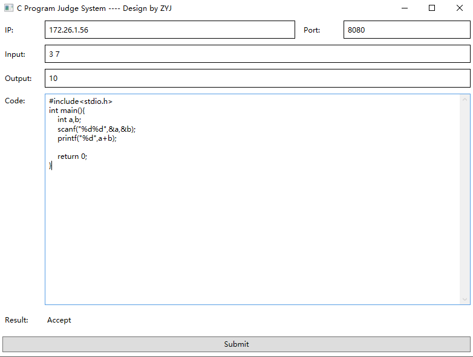

# JudgeSystem
>基于.Net的C语言判题系统

## 程序介绍
* 通过WPF客户端程序，向服务器提交输入、输出及代码
* 提交内容通过ip及端口号（即套接字）找到对应服务器
* 服务器（C#控制台程序）检测到新的连接请求，开辟新的线程处理用户请求
* 服务器调用gcc.exe编译提交的C程序代码，并运行生成的可执行文件
* 将结果返回给客户端，结果有3种状态
  * Accept：提交结果正确，程序通过
  * Wrong Answer：提交结果错误，程序不通过
  * Compilation Error：编译错误，程序不通过
* 客户端接收服务器端返回的结果，并显示在界面上
* 传输过程使用类似PPP协议的字符填充法，实现透明传输及字符串正确分割
* 子线程通过Dispatcher机制通知主线程更新UI

## 应用界面

